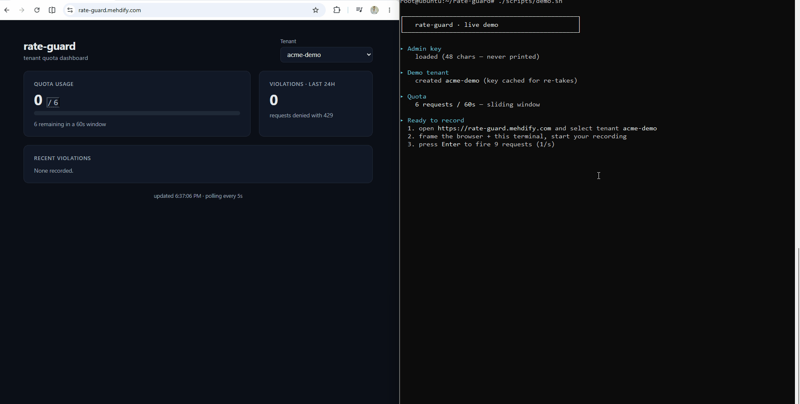
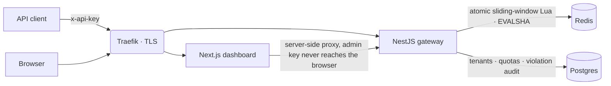

# RateGuard

Multi-tenant rate-limiting API gateway — atomic Redis sliding window (Lua), Postgres audit trail, live dashboard.



**Live dashboard:** [rate-guard.mehdify.com](https://rate-guard.mehdify.com) ·
**API + Swagger:** [rate-guard-api.mehdify.com/docs](https://rate-guard-api.mehdify.com/docs)

## Performance

k6 against the production Docker stack — [full report](docs/LOAD_TEST.md):

| Load | p50 | p95 | p99 | errors |
| --- | --- | --- | --- | --- |
| **200 req/s** sustained (60s hold) | 0.68 ms | **1.96 ms** | 2.71 ms | **0** / 17,552 requests |

Under an exhausted 5 req/60s quota the limiter admitted **exactly** 5 requests
per sliding window — 1,020 rejections, every one a well-formed 429 with
`Retry-After`. Every PR re-checks latency in CI
([perf gate](.github/workflows/perf-gate.yml): 50 req/s, fails above p95 80ms).

## Architecture



Every request carries a correlation id (`X-Request-Id`) that joins the
response headers, the structured pino logs, and the violation audit rows.

Why sliding window over token bucket, why one Lua script, why the audit
lives in Postgres: [docs/ADR.md](docs/ADR.md).

## Local setup

```bash
git clone https://github.com/imehdi79/rate-guard && cd rate-guard
bun install
cp apps/server/.env.example apps/server/.env && cp apps/client/.env.example apps/client/.env
docker compose -f apps/server/docker-compose.yml up -d db redis migrate && (cd apps/server && bunx prisma generate)
bunx nx run-many -t serve dev
```

Dashboard: http://localhost:3000 · API + docs: http://localhost:3001/docs
